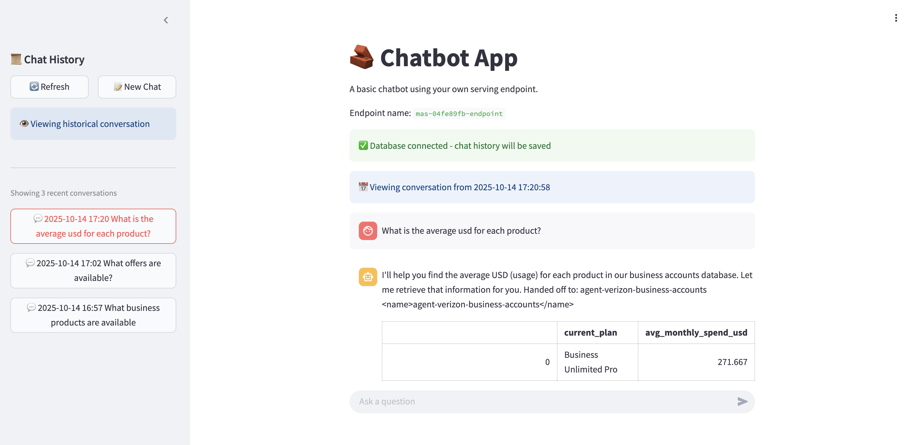

# 🧱 E2E Chatbot App

A production-ready chatbot application built with **Databricks Model Serving endpoint (works with AgentBricks)** and **LakeBase**, featuring a modern Streamlit interface with chat history persistence and real-time streaming responses.



## Overview

This application demonstrates an end-to-end conversational AI solution leveraging the Databricks ecosystem:

- **🧱 AgentBricks**: Powered by Databricks' Agent Framework, supporting multiple agent types including ChatAgent, ResponsesAgent, and standard chat completions
- **🗄️ LakeBase**: PostgreSQL-backed chat history persistence using Databricks LakeBase for reliable data storage
- **⚡ Streamlit**: Modern, responsive UI with real-time streaming responses
- **🔐 OAuth Integration**: Secure authentication via Databricks Workspace OAuth tokens

## Features

### Core Functionality
- **Multi-Agent Support**: Compatible with `chat/completions`, `agent/v2/chat`, and `agent/v1/responses` endpoint types
- **Streaming Responses**: Real-time token streaming for responsive user experience
- **Tool Calling**: Full support for function/tool calling with visual feedback
- **Feedback System**: Built-in thumbs up/down feedback mechanism for continuous improvement

### Chat History
- **Persistent Storage**: All conversations saved to LakeBase PostgreSQL database
- **Historical View**: Browse and view past conversations from the sidebar
- **Database Resilience**: Graceful fallback if database is unavailable

### User Experience
- **Modern UI**: Clean, intuitive interface with emoji indicators
- **Context Display**: View metadata including request IDs, endpoints, and timestamps
- **Error Handling**: Automatic retry with non-streaming fallback on errors

## Architecture

```
┌─────────────────┐
│   Streamlit UI  │
└────────┬────────┘
         │
         ├──► AgentBricks Serving Endpoint
         │    (ChatAgent/ResponsesAgent/ChatModel)
         │
         └──► LakeBase PostgreSQL
              (Chat History Storage)
```

## Prerequisites

- **Databricks Workspace**: Access to a Databricks workspace with Model Serving enabled
- **Serving Endpoint**: A deployed AgentBricks endpoint with `CAN_QUERY` permissions
- **LakeBase**: PostgreSQL database credentials configured in environment variables
- **Python**: Version 3.9 or higher

## Installation

1. **Clone the repository**
   ```bash
   git clone <repository-url>
   cd e2e-chatbot-app
   ```

2. **Install dependencies**
   ```bash
   pip install -r requirements.txt
   ```

3. **Configure environment variables**

   Create a `.env` file with the following variables:

   ```env
   # Serving Endpoint
   SERVING_ENDPOINT=your-endpoint-name
   
   # LakeBase PostgreSQL Configuration
   PGDATABASE=your_database_name
   PGUSER=your_username
   PGHOST=your_host.cloud.databricks.com
   PGPORT=5432
   PGSSLMODE=require
   PGAPPNAME=chatbot_app
   ```

4. **Run the application**
   ```bash
   streamlit run app.py
   ```

## Deployment

### Databricks Apps Deployment

This application is designed for seamless deployment as a Databricks App:

1. **Configure `app.yaml`**
   
   The included `app.yaml` file defines the deployment configuration:
   ```yaml
   command: ["streamlit", "run", "app.py"]
   env:
     - name: STREAMLIT_BROWSER_GATHER_USAGE_STATS
       value: "false"
     - name: "SERVING_ENDPOINT"
       valueFrom: "serving-endpoint"
   ```

2. **Deploy using Databricks CLI**
   ```bash
   databricks apps create chatbot-app \
     --source-code-path . \
     --config app.yaml
   ```

3. **Grant Permissions**
   
   Ensure the app has `CAN_QUERY` permissions on your serving endpoint.

## Project Structure

```
e2e-chatbot-app/
├── app.py                    # Main Streamlit application
├── messages.py               # Message classes for chat interface
├── model_serving_utils.py    # AgentBricks endpoint utilities
├── requirements.txt          # Python dependencies
├── app.yaml                 # Databricks app configuration
├── .env                     # Environment variables (not committed)
└── README.md               # This file
```

## Key Components

### AgentBricks Integration

The application intelligently detects and adapts to different endpoint types:

- **ChatAgent (`agent/v2/chat`)**: Streaming chat with tool calling support
- **ResponsesAgent (`agent/v1/responses`)**: Event-based streaming with function calls
- **Chat Completions**: Standard OpenAI-compatible chat interface

### LakeBase Chat History

Chat interactions are persisted in a PostgreSQL database with the following schema:

```sql
CREATE TABLE {schema}.chat_history (
    id SERIAL PRIMARY KEY,
    user_message TEXT NOT NULL,
    assistant_response TEXT NOT NULL,
    request_id TEXT,
    endpoint_name TEXT,
    created_at TIMESTAMP DEFAULT CURRENT_TIMESTAMP
)
```

The schema is dynamically created based on `PGAPPNAME` and `PGUSER` to support multi-tenancy.

### OAuth Token Management

PostgreSQL credentials use OAuth tokens that are automatically refreshed every 15 minutes:

```python
def refresh_oauth_token():
    workspace_client.config.oauth_token().access_token
```

## Usage Examples

### Basic Chat
1. Launch the app and enter a question in the chat input
2. View the streaming response in real-time
3. Provide feedback using thumbs up/down

### Tool Calling
When the agent needs to call tools, you'll see:
```
🛠️ Calling `get_weather` with:
{
  "location": "San Francisco"
}
```

### Chat History
- Click **🔄 Refresh** to reload recent conversations
- Click any conversation to view its full contents
- Click **📝 New Chat** to start a fresh conversation

## Troubleshooting

### Database Connection Issues
If you see "⚠️ Running without database persistence":
- Verify LakeBase credentials in `.env`
- Check OAuth token refresh settings
- Ensure network connectivity to PostgreSQL host

### Endpoint Errors
If responses fail:
- Verify `SERVING_ENDPOINT` environment variable
- Check endpoint permissions (`CAN_QUERY`)
- Review endpoint logs in Databricks workspace

### Streaming Issues
The app automatically falls back to non-streaming mode if streaming fails.

## Contributing

Contributions are welcome! Please follow these guidelines:
1. Fork the repository
2. Create a feature branch
3. Add tests for new functionality
4. Submit a pull request

## License

This project is licensed under the MIT License.

## Resources

- [Databricks Agent Framework Documentation](https://docs.databricks.com/en/generative-ai/agent-framework/index.html)
- [Databricks Apps Documentation](https://docs.databricks.com/en/generative-ai/agent-framework/chat-app.html)
- [LakeBase Documentation](https://docs.databricks.com/en/lakehouse-architecture/lakebase.html)
- [Streamlit Documentation](https://docs.streamlit.io)

## Support

For issues and questions:
- Open an issue in this repository
- Contact the Databricks support team
- Check the Databricks community forums

---

**Built with ❤️ using Databricks AgentBricks and LakeBase**

